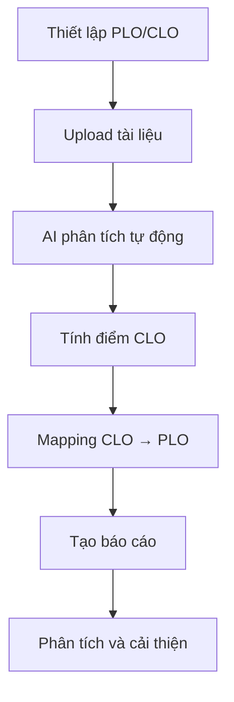

# Hướng dẫn Sử dụng Hệ thống

## Nền tảng Đánh giá CLO/PLO - Khoa Cơ khí EAUT

---

## 📚 Mục lục

1. [Giới thiệu Hệ thống](#giới-thiệu-hệ-thống)
2. [Đăng nhập và Giao diện](#đăng-nhập-và-giao-diện)
3. [Dashboard Tổng quan](#dashboard-tổng-quan)
4. [Quản lý PLO](#quản-lý-plo)
5. [Quản lý CLO](#quản-lý-clo)
6. [Tải lên Tài liệu](#tải-lên-tài-liệu)
7. [Xem Kết quả Đánh giá](#xem-kết-quả-đánh-giá)
8. [Báo cáo và Phân tích](#báo-cáo-và-phân-tích)
9. [Quản lý Dữ liệu](#quản-lý-dữ-liệu)
10. [Câu hỏi Thường gặp](#câu-hỏi-thường-gặp)

---

## 🎯 Giới thiệu Hệ thống

### Mục đích Sử dụng

Nền tảng Đánh giá CLO/PLO được thiết kế để hỗ trợ giảng viên và cán bộ quản lý giáo dục trong việc:

- **Đánh giá tự động** mức độ đạt chuẩn đầu ra môn học (CLO)
- **Theo dõi** mức độ đạt chuẩn đầu ra chương trình (PLO)
- **Phân tích** xu hướng và cải thiện chất lượng đào tạo
- **Tạo báo cáo** chi tiết cho các cơ quan quản lý

### Đối tượng Sử dụng

- **Giảng viên**: Upload và đánh giá tài liệu sinh viên
- **Trưởng bộ môn**: Theo dõi CLO của các môn học
- **Lãnh đạo khoa**: Giám sát PLO của chương trình đào tạo
- **Phòng Đào tạo**: Tạo báo cáo tổng hợp

### Quy trình Làm việc



---

## 🔐 Đăng nhập và Giao diện

### Truy cập Hệ thống

1. **Mở trình duyệt web** (Chrome, Firefox, Safari, Edge)
2. **Nhập địa chỉ**: `http://localhost:5174` (hoặc địa chỉ server)
3. **Chờ tải trang**: Hệ thống sẽ hiển thị giao diện chính

### Giao diện Chính

#### Header (Thanh tiêu đề)
- **Logo và tên**: "Nền tảng đánh giá CLO/PLO"
- **Thông tin trường**: "Khoa Cơ khí - Trường Đại học Công nghệ Đông Á (EAUT)"
- **Trạng thái hệ thống**: Badge "Hệ thống hoạt động" (xanh lá)

#### Navigation Bar (Thanh điều hướng)
- **Dashboard** 📊: Trang tổng quan
- **PLO** 🎯: Quản lý chuẩn đầu ra chương trình
- **CLO** 📚: Quản lý chuẩn đầu ra môn học
- **Tải tài liệu** 📤: Upload tài liệu đánh giá
- **Kết quả** 📋: Xem kết quả đánh giá

#### Content Area (Khu vực nội dung)
- Hiển thị nội dung tương ứng với tab được chọn
- Layout responsive, tự động điều chỉnh theo kích thước màn hình

---

## 📊 Dashboard Tổng quan

### Thẻ Thống kê (Stats Cards)

#### 1. Tổng số PLO
- **Hiển thị**: Số lượng PLO đã định nghĩa
- **Mô tả**: "Chuẩn đầu ra chương trình"
- **Icon**: 🎯 Target

#### 2. Tổng số CLO  
- **Hiển thị**: Số lượng CLO đã định nghĩa
- **Mô tả**: "Chuẩn đầu ra môn học"
- **Icon**: 📚 BookOpen

#### 3. Tài liệu đã xử lý
- **Hiển thị**: Số tài liệu đã được AI phân tích
- **Mô tả**: "Tổng số: X tài liệu"
- **Icon**: 📄 FileText

#### 4. Điểm trung bình
- **Hiển thị**: Điểm CLO trung bình (thang 4.0)
- **Mô tả**: "Thang điểm 4.0"
- **Icon**: 📈 TrendingUp

### Biểu đồ Phân tích

#### 1. Mức độ đạt PLO (Bar Chart)
- **Trục X**: Mã PLO (PLO4, PLO5, PLO6, PLO10, PLO12)
- **Trục Y**: Điểm số (0-4.0)
- **Cột xanh**: Điểm đạt được
- **Cột xám**: Mục tiêu (4.0)

#### 2. Mức độ đạt CLO (Bar Chart)
- **Trục X**: Mã CLO (CLO1, CLO2, CLO3, CLO4)
- **Trục Y**: Điểm số (0-4.0)
- **Cột xanh lá**: Điểm CLO theo môn học

#### 3. Phân bố mức độ đạt chuẩn (Pie Chart)
- **Xuất sắc (3.5-4.0)**: Màu xanh lá
- **Tốt (2.5-3.4)**: Màu xanh dương
- **Trung bình (1.5-2.4)**: Màu vàng
- **Yếu (<1.5)**: Màu đỏ

#### 4. Xu hướng điểm số (Line Chart)
- **Trục X**: Tháng (T1, T2, T3, ...)
- **Trục Y**: Điểm trung bình (0-4.0)
- **Đường tím**: Biến động theo thời gian

### Hoạt động Gần đây

#### Trạng thái API Backend
- **Kết nối thành công**: Badge xanh "API kết nối"
- **Mất kết nối**: Badge đỏ "API ngắt kết nối"
- **Đang kiểm tra**: Badge vàng "Đang kiểm tra..."

#### Dữ liệu PLO/CLO
- **Trạng thái**: Badge xanh "Hoàn thành"
- **Thông tin**: "X PLO và Y CLO từ chương trình CNKT Ô tô"

#### Tài liệu đánh giá
- **Trạng thái**: Badge vàng "Đang chờ"
- **Hướng dẫn**: "Tải lên tài liệu để bắt đầu đánh giá CLO/PLO"

---

## 🎯 Quản lý PLO

### Xem Danh sách PLO

#### Truy cập
1. Click tab **"PLO"** trên thanh điều hướng
2. Hệ thống hiển thị trang "Quản lý PLO"

#### Giao diện Danh sách
- **Tiêu đề**: "Quản lý PLO - Program Learning Outcomes - Chuẩn đầu ra chương trình"
- **Thanh công cụ**: Import CSV, Export CSV, Thêm PLO
- **Thanh tìm kiếm**: "Tìm kiếm PLO..."
- **Thống kê**: "Thống kê PLO" (có thể thu gọn)

#### Thẻ PLO (PLO Cards)
Mỗi PLO hiển thị dưới dạng thẻ với thông tin:

**PLO4 - Áp dụng kiến thức kỹ thuật**
- **Mô tả**: "Áp dụng, xây dựng và giải quyết các vấn đề kỹ thuật trong CNKT ô tô"
- **Danh mục**: "Kiến thức chuyên môn"
- **Performance Indicators**: PI 4.1, PI 4.2
- **Badges**: Số thứ tự (10, 11) với màu sắc khác nhau

### Thêm PLO Mới

#### Bước 1: Mở Form
1. Click nút **"Thêm PLO"** (màu đỏ, icon +)
2. Hệ thống mở dialog/form thêm mới

#### Bước 2: Điền Thông tin
- **Mã PLO**: Ví dụ "PLO13"
- **Tiêu đề**: Tên ngắn gọn của PLO
- **Mô tả chi tiết**: Mô tả đầy đủ về PLO
- **Danh mục**: Chọn từ dropdown
  - Kiến thức chuyên môn
  - Kỹ năng thực hành  
  - Thiết kế & chế tạo
  - Phẩm chất đạo đức nghề nghiệp
- **Performance Indicators**: Danh sách PI liên quan

#### Bước 3: Lưu PLO
1. Click nút **"Lưu"**
2. Hệ thống xác thực dữ liệu
3. Hiển thị thông báo thành công
4. PLO mới xuất hiện trong danh sách

### Chỉnh sửa PLO

#### Bước 1: Chọn PLO
1. Click vào thẻ PLO cần chỉnh sửa
2. Hoặc click icon "Edit" trên thẻ

#### Bước 2: Sửa Thông tin
1. Form chỉnh sửa hiển thị với dữ liệu hiện tại
2. Thay đổi các trường cần thiết
3. Click **"Cập nhật"**

#### Bước 3: Xác nhận
1. Hệ thống hiển thị preview thay đổi
2. Click **"Xác nhận"** để lưu
3. Hoặc **"Hủy"** để không lưu

### Xóa PLO

#### Cảnh báo
⚠️ **Lưu ý**: Xóa PLO sẽ ảnh hưởng đến mapping CLO → PLO

#### Bước thực hiện
1. Click icon "Delete" (🗑️) trên thẻ PLO
2. Hệ thống hiển thị dialog xác nhận:
   - "Bạn có chắc chắn muốn xóa PLO này?"
   - "Hành động này không thể hoàn tác"
   - Danh sách CLO bị ảnh hưởng
3. Click **"Xóa"** để xác nhận
4. Hoặc **"Hủy"** để giữ lại

### Import/Export PLO

#### Import từ CSV
1. Click nút **"Import CSV"**
2. Chọn file CSV với format:
   ```csv
   code,title,description,category,performance_indicators
   PLO4,Áp dụng kiến thức kỹ thuật,"Áp dụng, xây dựng...",Kiến thức chuyên môn,"PI 4.1,PI 4.2"
   ```
3. Click **"Upload"**
4. Xem preview và xác nhận

#### Export ra CSV
1. Click nút **"Export CSV"**
2. Chọn định dạng:
   - CSV chuẩn
   - Excel format
   - PDF report
3. File tự động download

---

## 📚 Quản lý CLO

### Xem Danh sách CLO

#### Truy cập
1. Click tab **"CLO"** trên thanh điều hướng
2. Hệ thống hiển thị trang "Quản lý CLO"

#### Giao diện Danh sách
- **Tiêu đề**: "Quản lý CLO - Course Learning Outcomes - Chuẩn đầu ra môn học"
- **Thanh công cụ**: Import CSV, Export CSV, Thêm CLO
- **Bộ lọc**: "Tất cả môn học" (dropdown)
- **Thanh tìm kiếm**: "Tìm kiếm CLO..."

#### Bảng CLO
Hiển thị dạng bảng với các cột:

| Mã CLO | Môn học | Tiêu đề | Mức độ đánh giá | PLO liên kết | Thao tác |
|--------|---------|---------|-----------------|--------------|----------|
| CLO1 | ME2252 Vẽ kỹ thuật | Hiểu các hệ lực cơ học | Hiểu biết | PLO4 | 🔗 📝 🗑️ |
| CLO2 | ME2252 Vẽ kỹ thuật | Xây dựng mô hình lực | Áp dụng | PLO4 | 🔗 📝 🗑️ |

#### Thống kê CLO (Cards)
- **Tổng số CLO**: 4
- **Hiểu biết**: 1 (màu xanh)
- **Áp dụng**: 2 (màu xanh dương)  
- **Thái độ**: 1 (màu tím)

### Thêm CLO Mới

#### Bước 1: Mở Form
1. Click nút **"Thêm CLO"** (màu đỏ, icon +)
2. Dialog thêm CLO hiển thị

#### Bước 2: Điền Thông tin Cơ bản
- **Mã CLO**: Ví dụ "CLO5"
- **Mã môn học**: Ví dụ "ME2252"
- **Tên môn học**: Ví dụ "Vẽ kỹ thuật"
- **Tiêu đề CLO**: Tên ngắn gọn
- **Mô tả chi tiết**: Mô tả đầy đủ về CLO

#### Bước 3: Cấu hình Đánh giá
- **Mức độ đánh giá**: Chọn từ dropdown
  - Hiểu biết (Remember/Understand)
  - Áp dụng (Apply/Analyze)
  - Thái độ (Attitude/Values)
- **Từ khóa đánh giá**: Danh sách keywords
  - Ví dụ: "hệ lực", "cân bằng lực", "tiên đề tĩnh học"
- **Phương pháp tính điểm**: 
  - Presence (có/không)
  - Term Frequency (tần suất)
  - Distinct (phân biệt)

#### Bước 4: Mapping PLO
- **Chọn PLO liên kết**: Checkbox multiple choice
- **Xem preview mapping**: Hiển thị mối quan hệ CLO → PLO
- **Xác nhận mapping**: Đảm bảo logic đúng

#### Bước 5: Lưu CLO
1. Click **"Lưu CLO"**
2. Hệ thống validate dữ liệu
3. Hiển thị thông báo thành công
4. CLO mới xuất hiện trong bảng

### Chỉnh sửa CLO

#### Truy cập Form Chỉnh sửa
1. Click icon "Edit" (📝) trong cột "Thao tác"
2. Hoặc double-click vào dòng CLO
3. Form chỉnh sửa hiển thị với dữ liệu hiện tại

#### Các Trường Có thể Sửa
- ✅ Tiêu đề và mô tả CLO
- ✅ Mức độ đánh giá
- ✅ Từ khóa đánh giá
- ✅ Phương pháp tính điểm
- ✅ Mapping PLO
- ❌ Mã CLO (không thể sửa)
- ❌ Mã môn học (không thể sửa)

#### Lưu Thay đổi
1. Sửa các trường cần thiết
2. Click **"Cập nhật CLO"**
3. Xem preview thay đổi
4. Click **"Xác nhận"**

### Quản lý Keywords và Scoring

#### Cấu hình Keywords
1. Click icon "Link" (🔗) trong cột "Thao tác"
2. Dialog "Cấu hình Keywords" hiển thị
3. **Thêm keyword**:
   - Nhập từ khóa mới
   - Chọn trọng số (1-5)
   - Click **"Thêm"**
4. **Sửa keyword**:
   - Click vào keyword trong danh sách
   - Sửa text hoặc trọng số
   - Click **"Cập nhật"**
5. **Xóa keyword**:
   - Click icon "X" bên cạnh keyword
   - Xác nhận xóa

#### Cấu hình Scoring Scale
1. Trong dialog Keywords, tab **"Scoring"**
2. **Phương pháp tính điểm**:
   - **Presence**: Có/không có keyword (0 hoặc full_score)
   - **Term Frequency**: Dựa trên tần suất xuất hiện
   - **Distinct**: Dựa trên số lượng keyword khác nhau
3. **Thông số**:
   - **Full Score At**: Điểm tối đa khi đạt X matches
   - **Partial Floor**: Điểm tối thiểu (tỷ lệ của full score)
4. **Preview**: Xem ví dụ tính điểm với text mẫu

### Lọc và Tìm kiếm CLO

#### Lọc theo Môn học
1. Click dropdown **"Tất cả môn học"**
2. Chọn môn học cụ thể:
   - ME2252 - Vẽ kỹ thuật
   - ME2205 - Cơ học kỹ thuật
   - AET3217 - Kết cấu tính toán ô tô
   - ...
3. Bảng tự động lọc CLO theo môn học

#### Tìm kiếm Text
1. Nhập từ khóa vào ô **"Tìm kiếm CLO..."**
2. Hệ thống tìm trong:
   - Mã CLO
   - Tiêu đề CLO
   - Mô tả CLO
   - Tên môn học
3. Kết quả hiển thị real-time

#### Lọc theo Mức độ Đánh giá
1. Click vào cards thống kê:
   - **Hiểu biết**: Lọc CLO mức độ hiểu biết
   - **Áp dụng**: Lọc CLO mức độ áp dụng
   - **Thái độ**: Lọc CLO mức độ thái độ
2. Bảng hiển thị CLO theo mức độ đã chọn

---

## 📤 Tải lên Tài liệu

### Truy cập Trang Upload

#### Bước 1: Điều hướng
1. Click tab **"Tải tài liệu"** trên thanh điều hướng
2. Trang "Tải tài liệu đánh giá" hiển thị

#### Giao diện Upload
- **Tiêu đề**: "Tải tài liệu đánh giá"
- **Mô tả**: "Tải lên tài liệu để đánh giá mức độ đạt chuẩn đầu ra CLO/PLO"
- **Cấu hình đánh giá**: Form chọn môn học và loại tài liệu
- **Khu vực upload**: Drag & drop area
- **Hướng dẫn sử dụng**: Các bước thực hiện

### Cấu hình Đánh giá

#### Chọn Môn học
1. Click dropdown **"Chọn môn học"**
2. Danh sách môn học hiển thị:
   - ME2252 - Vẽ kỹ thuật
   - ME2205 - Cơ học kỹ thuật
   - AET3217 - Kết cấu tính toán ô tô
   - AET3218 - Cấu tạo ô tô
   - AET3219 - Trang bị điện trên ô tô
3. Chọn môn học phù hợp
4. Hệ thống tự động load CLO tương ứng

#### Chọn Loại Tài liệu
1. Click dropdown **"Loại tài liệu"**
2. Các loại hỗ trợ:
   - **Bài tập**: Assignment, homework
   - **Bài kiểm tra**: Quiz, test, exam
   - **Đồ án**: Project, thesis
   - **Báo cáo**: Report, presentation
   - **Thực hành**: Lab report, practical work
3. Chọn loại phù hợp với tài liệu

### Upload Tài liệu

#### Phương pháp 1: Drag & Drop
1. **Kéo file** từ File Explorer/Finder
2. **Thả vào** khu vực "Kéo thả tài liệu vào đây"
3. Hệ thống tự động nhận diện file

#### Phương pháp 2: Chọn File
1. Click nút **"Chọn tệp tin"**
2. Dialog chọn file hiển thị
3. Chọn file từ máy tính
4. Click **"Open"**

#### Định dạng Hỗ trợ
- **PDF**: .pdf (khuyến nghị)
- **Word**: .doc, .docx
- **Text**: .txt
- **Kích thước**: Tối đa 50MB

#### Xem Preview Upload
Sau khi chọn file, hệ thống hiển thị:
- **Tên file**: Tên gốc của file
- **Kích thước**: Dung lượng file
- **Loại**: Định dạng file
- **Trạng thái**: "Sẵn sàng upload"
- **Nút hành động**: "Upload" và "Hủy"

### Xử lý và Đánh giá

#### Bước 1: Bắt đầu Upload
1. Click nút **"Upload"**
2. Progress bar hiển thị tiến độ upload
3. Thông báo "Đang tải lên..." xuất hiện

#### Bước 2: Xử lý AI
Sau khi upload thành công:
1. **Trích xuất nội dung**: AI đọc và parse file
2. **Phân tích ngữ nghĩa**: Hiểu nội dung tiếng Việt
3. **Tìm keywords**: Match với CLO keywords
4. **Tính điểm CLO**: Theo thuật toán đã cấu hình
5. **Mapping PLO**: Chuyển đổi CLO → PLO

#### Bước 3: Hiển thị Kết quả
1. **Thông báo thành công**: "Đánh giá hoàn thành!"
2. **Tóm tắt kết quả**:
   - Số CLO được đánh giá
   - Điểm trung bình
   - Thời gian xử lý
3. **Nút hành động**:
   - **"Xem chi tiết"**: Chuyển đến trang kết quả
   - **"Tải thêm"**: Upload tài liệu khác

### Theo dõi Tiến độ

#### Real-time Progress
- **Upload progress**: 0-100% cho việc tải file
- **Processing progress**: 0-100% cho AI analysis
- **Status messages**: 
  - "Đang tải lên tài liệu..."
  - "Đang trích xuất nội dung..."
  - "Đang phân tích CLO..."
  - "Đang tính toán điểm số..."
  - "Hoàn thành đánh giá!"

#### Xử lý Lỗi
Nếu có lỗi trong quá trình xử lý:
1. **Lỗi upload**: "Không thể tải lên file"
   - Kiểm tra kích thước file
   - Kiểm tra định dạng file
   - Thử lại sau
2. **Lỗi processing**: "Không thể phân tích nội dung"
   - File có thể bị corrupt
   - Nội dung không đọc được
   - Liên hệ support
3. **Lỗi AI**: "Lỗi đánh giá CLO"
   - Hệ thống AI tạm thời không khả dụng
   - Thử lại sau vài phút

---

## 📋 Xem Kết quả Đánh giá

### Truy cập Trang Kết quả

#### Điều hướng
1. Click tab **"Kết quả"** trên thanh điều hướng
2. Trang "Kết quả đánh giá" hiển thị

#### Giao diện Chính
- **Tiêu đề**: "Kết quả đánh giá - Xem và phân tích kết quả đánh giá CLO/PLO"
- **Tab switching**: "Danh sách" và "Phân tích"
- **Thanh tìm kiếm**: "Tìm kiếm tài liệu, sinh viên..."
- **Bộ lọc**: "Tất cả môn học"

### Tab Danh sách Kết quả

#### Bảng Kết quả
Hiển thị danh sách tất cả đánh giá với các cột:

| Tài liệu | Sinh viên | Môn học | Điểm tổng thể | Mức độ đạt | Ngày đánh giá | Thao tác |
|----------|-----------|---------|---------------|------------|---------------|----------|
| 📄 Bài tập tuần 1 - Nguyễn Văn A.pdf | 👤 Nguyễn Văn A | ME2252 Vẽ kỹ thuật | 3.3/4.0 | Tốt | 📅 2024-01-15 | 🔍 📊 |
| 📄 Bài kiểm tra giữa kỳ - Trần Thị B.pdf | 👤 Trần Thị B | ME2252 Vẽ kỹ thuật | 2.8/4.0 | Trung bình | 📅 2024-01-20 | 🔍 📊 |

#### Thông tin Hiển thị
- **Icon tài liệu**: 📄 cho Assignment, 📝 cho Exam
- **Tên file**: Tên gốc của tài liệu
- **Thông tin sinh viên**: Tên hoặc mã sinh viên
- **Môn học**: Mã và tên môn học
- **Điểm tổng thể**: Điểm trung bình các CLO
- **Mức độ đạt**: 
  - 🟢 **Tốt** (2.5-4.0)
  - 🟡 **Trung bình** (1.5-2.4)
  - 🔴 **Yếu** (<1.5)
- **Ngày đánh giá**: Timestamp của lần đánh giá
- **Thao tác**: 
  - 🔍 **Xem chi tiết**
  - 📊 **Phân tích**

### Xem Chi tiết Kết quả

#### Truy cập Chi tiết
1. Click icon 🔍 **"Xem chi tiết"** trong cột "Thao tác"
2. Dialog/Page chi tiết hiển thị

#### Thông tin Tổng quan
- **Thông tin tài liệu**:
  - Tên file gốc
  - Kích thước file
  - Loại tài liệu
  - Ngày upload
- **Thông tin sinh viên**:
  - Tên sinh viên
  - Mã sinh viên (nếu có)
  - Lớp/khóa học
- **Thông tin môn học**:
  - Mã môn học
  - Tên môn học
  - Giảng viên phụ trách

#### Kết quả CLO Chi tiết

**Bảng Điểm CLO**

| CLO | Tiêu đề | Keywords Found | Điểm | Mức độ |
|-----|---------|----------------|------|--------|
| CLO1 | Hiểu các hệ lực cơ học | "hệ lực", "cân bằng" | 3.2/4.0 | Tốt |
| CLO2 | Xây dựng mô hình lực | "mô hình", "phương trình" | 2.8/4.0 | Tốt |
| CLO3 | Phân tích tính toán | "tính toán", "phân tích" | 3.5/4.0 | Tốt |
| CLO4 | Thái độ học tập | "nghiêm túc", "tích cực" | 3.0/4.0 | Tốt |

#### Keywords Analysis
Cho mỗi CLO, hiển thị:
- **Keywords tìm thấy**: Danh sách từ khóa được AI phát hiện
- **Vị trí trong text**: Highlight keywords trong nội dung
- **Tần suất xuất hiện**: Số lần xuất hiện của mỗi keyword
- **Điểm thành phần**: Điểm cho từng keyword
- **Tổng điểm CLO**: Điểm cuối cùng sau tính toán

#### Mapping PLO
- **CLO → PLO mapping**: Hiển thị mối quan hệ
- **Điểm PLO tương ứng**: Điểm PLO được tính từ CLO
- **Biểu đồ radar**: Visualize mức độ đạt các PLO

### Tab Phân tích

#### Thống kê Tổng quan
Cards hiển thị:
- **Tổng số đánh giá**: 2
- **Điểm trung bình**: 3.0
- **Đạt xuất sắc**: 0
- **Cần cải thiện**: 0

#### Biểu đồ Phân tích

##### 1. Hiệu suất CLO trung bình
- **Loại**: Bar chart
- **Trục X**: Mã CLO (CLO1, CLO2, CLO3, CLO4)
- **Trục Y**: Điểm trung bình (0-4.0)
- **Màu sắc**: Gradient xanh dương
- **Tooltip**: Hiển thị điểm chính xác khi hover

##### 2. Phân bố điểm số
- **Loại**: Histogram
- **Trục X**: Khoảng điểm (0-1, 1-2, 2-3, 3-4)
- **Trục Y**: Số lượng sinh viên
- **Màu sắc**: Theo mức độ (đỏ, vàng, xanh)

##### 3. Xu hướng theo thời gian
- **Loại**: Line chart
- **Trục X**: Thời gian (ngày/tuần/tháng)
- **Trục Y**: Điểm trung bình
- **Đường**: Màu tím, smooth curve
- **Markers**: Điểm đánh giá cụ thể

##### 4. So sánh CLO
- **Loại**: Radar chart
- **Trục**: Các CLO (CLO1, CLO2, CLO3, CLO4)
- **Vùng**: Điểm trung bình của lớp
- **Đường**: Điểm mục tiêu (4.0)

### Lọc và Tìm kiếm Kết quả

#### Tìm kiếm Text
1. Nhập từ khóa vào ô **"Tìm kiếm tài liệu, sinh viên..."**
2. Hệ thống tìm trong:
   - Tên file tài liệu
   - Tên sinh viên
   - Mã sinh viên
   - Nội dung tài liệu (nếu được index)
3. Kết quả highlight từ khóa tìm thấy

#### Lọc theo Môn học
1. Click dropdown **"Tất cả môn học"**
2. Chọn môn học cụ thể
3. Bảng chỉ hiển thị kết quả của môn học đó

#### Lọc theo Mức độ Đạt
1. Click vào legend của biểu đồ
2. Hoặc sử dụng filter sidebar:
   - ✅ Xuất sắc (3.5-4.0)
   - ✅ Tốt (2.5-3.4)
   - ✅ Trung bình (1.5-2.4)
   - ❌ Yếu (<1.5)

#### Lọc theo Thời gian
1. Chọn **Date Range Picker**
2. Từ ngày: \_\_/\_\_/\_\_\_\_
3. Đến ngày: \_\_/\_\_/\_\_\_\_
4. Click **"Áp dụng"**

### Export Kết quả

#### Export Danh sách
1. Click nút **"Export"** trên thanh công cụ
2. Chọn định dạng:
   - **Excel (.xlsx)**: Bảng chi tiết với formatting
   - **CSV (.csv)**: Dữ liệu thô cho phân tích
   - **PDF Report**: Báo cáo có biểu đồ

#### Export Chi tiết
1. Trong trang chi tiết kết quả
2. Click **"Tải báo cáo PDF"**
3. File PDF bao gồm:
   - Thông tin tài liệu và sinh viên
   - Bảng điểm CLO chi tiết
   - Keywords analysis
   - Biểu đồ PLO mapping
   - Nhận xét và đề xuất

---

## 📊 Báo cáo và Phân tích

### Báo cáo Tổng hợp

#### Truy cập Báo cáo
1. Từ Dashboard, click **"Tạo báo cáo"**
2. Hoặc từ tab Kết quả, click **"Báo cáo tổng hợp"**

#### Cấu hình Báo cáo
- **Phạm vi thời gian**: 
  - Tuần này
  - Tháng này
  - Học kỳ này
  - Tùy chỉnh (từ ngày - đến ngày)
- **Môn học**: 
  - Tất cả môn học
  - Chọn môn học cụ thể
  - Nhóm môn học
- **Loại báo cáo**:
  - Báo cáo CLO
  - Báo cáo PLO
  - Báo cáo tổng hợp
- **Định dạng xuất**:
  - PDF (khuyến nghị)
  - Excel
  - PowerPoint

#### Nội dung Báo cáo

##### 1. Trang bìa
- Logo trường và khoa
- Tiêu đề báo cáo
- Phạm vi thời gian
- Ngày tạo báo cáo
- Người tạo báo cáo

##### 2. Tóm tắt điều hành (Executive Summary)
- Tổng quan tình hình đạt chuẩn
- Các chỉ số chính (KPIs)
- Xu hướng cải thiện/suy giảm
- Khuyến nghị hành động

##### 3. Phân tích CLO
- Bảng điểm CLO theo môn học
- Biểu đồ so sánh CLO
- Phân tích xu hướng
- CLO có điểm thấp cần cải thiện

##### 4. Phân tích PLO
- Mapping CLO → PLO
- Điểm PLO tổng hợp
- So sánh với mục tiêu
- Phân tích gap

##### 5. Phân tích sinh viên
- Phân bố điểm số
- Sinh viên xuất sắc
- Sinh viên cần hỗ trợ
- Thống kê theo lớp/khóa

##### 6. Khuyến nghị
- Điểm mạnh cần phát huy
- Điểm yếu cần cải thiện
- Hành động cụ thể
- Timeline thực hiện

### Dashboard Analytics

#### Real-time Metrics
- **Số tài liệu được đánh giá hôm nay**
- **Điểm CLO trung bình tuần này**
- **Xu hướng cải thiện/suy giảm**
- **Tỷ lệ đạt chuẩn theo PLO**

#### Biểu đồ Tương tác
- **Zoom và Pan**: Phóng to/thu nhỏ biểu đồ
- **Hover Tooltips**: Hiển thị thông tin chi tiết
- **Click Drill-down**: Click để xem chi tiết
- **Export Charts**: Lưu biểu đồ dạng PNG/SVG

#### Alerts và Notifications
- **CLO có điểm thấp**: Cảnh báo khi CLO < 2.0
- **Xu hướng giảm**: Thông báo khi điểm giảm liên tục
- **Mục tiêu đạt được**: Chúc mừng khi đạt target
- **Cần review**: Nhắc nhở review định kỳ

### Phân tích Nâng cao

#### Correlation Analysis
- **CLO vs PLO**: Mối tương quan giữa CLO và PLO
- **Time Series**: Phân tích xu hướng theo thời gian
- **Student Performance**: Phân tích hiệu suất sinh viên
- **Course Comparison**: So sánh giữa các môn học

#### Predictive Analytics
- **Dự đoán điểm CLO**: Dựa trên xu hướng hiện tại
- **Risk Assessment**: Xác định sinh viên có nguy cơ không đạt
- **Improvement Forecast**: Dự báo cải thiện sau can thiệp
- **Resource Planning**: Lập kế hoạch tài nguyên giảng dạy

#### Statistical Reports
- **Descriptive Statistics**: Mean, median, std deviation
- **Distribution Analysis**: Normal distribution test
- **Confidence Intervals**: Khoảng tin cậy cho điểm số
- **Hypothesis Testing**: Kiểm định giả thuyết cải thiện

---

## 💾 Quản lý Dữ liệu

### Backup và Restore

#### Tự động Backup
Hệ thống tự động backup:
- **Hàng ngày**: Backup database lúc 2:00 AM
- **Hàng tuần**: Full backup vào Chủ nhật
- **Hàng tháng**: Archive backup lâu dài
- **Vị trí**: `/backup/` folder trong hệ thống

#### Manual Backup
1. Truy cập **Admin Panel** (nếu có quyền)
2. Click **"Backup Database"**
3. Chọn loại backup:
   - **Quick Backup**: Chỉ database
   - **Full Backup**: Database + uploaded files
   - **Export Data**: CSV/Excel format
4. Click **"Tạo Backup"**
5. Download file backup về máy

#### Restore từ Backup
1. Click **"Restore Database"**
2. Upload file backup (.sql hoặc .zip)
3. Chọn tùy chọn restore:
   - **Overwrite**: Ghi đè dữ liệu hiện tại
   - **Merge**: Kết hợp với dữ liệu hiện tại
4. Click **"Restore"** và xác nhận
5. Hệ thống restart để áp dụng

### Import/Export Dữ liệu

#### Import PLO từ CSV
```csv
code,title,description,category,performance_indicators
PLO1,Kiến thức cơ bản,"Hiểu biết kiến thức cơ bản",Kiến thức,"PI 1.1,PI 1.2"
PLO2,Kỹ năng phân tích,"Phân tích vấn đề kỹ thuật",Kỹ năng,"PI 2.1,PI 2.2"
```

#### Import CLO từ CSV
```csv
code,course_code,course_name,title,description,assessment_level,plo_mappings,keywords
CLO1,ME2252,Vẽ kỹ thuật,Hiểu hệ lực,"Hiểu các hệ lực cơ học",Hiểu biết,PLO4,"hệ lực,cân bằng"
CLO2,ME2252,Vẽ kỹ thuật,Mô hình lực,"Xây dựng mô hình lực",Áp dụng,PLO4,"mô hình,phương trình"
```

#### Export Kết quả
- **Format**: CSV, Excel, JSON, XML
- **Scope**: Tất cả hoặc filtered data
- **Fields**: Chọn columns cần export
- **Scheduling**: Tự động export định kỳ

### Quản lý File Upload

#### Thư mục Lưu trữ
```
uploads/
├── documents/
│   ├── 2024/
│   │   ├── 01/  # Tháng 1
│   │   └── 02/  # Tháng 2
│   └── 2025/
├── processed/   # Files đã xử lý
├── temp/        # Files tạm thời
└── archive/     # Files cũ
```

#### Cleanup Policy
- **Temp files**: Xóa sau 24 giờ
- **Processed files**: Giữ 1 năm
- **Archive**: Nén và lưu trữ lâu dài
- **Duplicate detection**: Tự động phát hiện file trùng

#### Storage Monitoring
- **Disk usage**: Theo dõi dung lượng sử dụng
- **File count**: Số lượng files theo thời gian
- **Large files**: Cảnh báo files > 10MB
- **Cleanup suggestions**: Đề xuất dọn dẹp

### Bảo mật Dữ liệu

#### Encryption
- **Database**: AES-256 encryption
- **File uploads**: Encrypted storage
- **Backup files**: Password protected
- **Network**: HTTPS/TLS 1.3

#### Access Control
- **User roles**: Admin, Teacher, Viewer
- **Permissions**: Read, Write, Delete, Export
- **Audit log**: Ghi lại tất cả hoạt động
- **Session management**: Timeout và security

#### Privacy Protection
- **Data anonymization**: Ẩn thông tin sinh viên
- **GDPR compliance**: Quyền xóa dữ liệu
- **Consent management**: Đồng ý sử dụng dữ liệu
- **Data retention**: Chính sách lưu trữ

---

## ❓ Câu hỏi Thường gặp

### Câu hỏi Chung

#### Q1: Hệ thống có cần kết nối internet không?
**A**: Không, hệ thống hoạt động hoàn toàn offline. Chỉ cần internet cho việc cài đặt ban đầu và cập nhật.

#### Q2: Hệ thống có hỗ trợ tiếng Việt không?
**A**: Có, hệ thống được thiết kế đặc biệt cho tiếng Việt với AI model được train cho ngôn ngữ Việt.

#### Q3: Có thể sử dụng cho nhiều khoa/trường khác không?
**A**: Có, hệ thống có thể tùy chỉnh cho các chương trình đào tạo khác nhau.

#### Q4: Dữ liệu có được bảo mật không?
**A**: Có, tất cả dữ liệu được mã hóa và lưu trữ local, không gửi ra ngoài.

### Câu hỏi Kỹ thuật

#### Q5: Yêu cầu phần cứng tối thiểu là gì?
**A**: CPU i5, 16GB RAM, 50GB storage. GPU không bắt buộc nhưng sẽ tăng tốc xử lý.

#### Q6: Hệ thống có thể xử lý bao nhiêu tài liệu cùng lúc?
**A**: Tùy thuộc vào phần cứng, thường 5-10 tài liệu/phút với CPU, 20-50 tài liệu/phút với GPU.

#### Q7: Làm sao để backup dữ liệu?
**A**: Hệ thống tự động backup hàng ngày. Có thể manual backup qua Admin Panel.

#### Q8: Có thể tích hợp với LMS hiện tại không?
**A**: Có, thông qua REST API. Cần customization cho từng LMS cụ thể.

### Câu hỏi Sử dụng

#### Q9: Làm sao để thêm môn học mới?
**A**: Thêm CLO mới với course_code khác. Hệ thống tự động tạo môn học mới.

#### Q10: Có thể sửa điểm CLO sau khi đánh giá không?
**A**: Có, có thể manual override điểm CLO trong trang chi tiết kết quả.

#### Q11: Làm sao để tùy chỉnh keywords cho CLO?
**A**: Vào trang CLO Management → Click icon Link → Sửa keywords và scoring method.

#### Q12: Có thể export báo cáo theo template riêng không?
**A**: Có, có thể tùy chỉnh template báo cáo trong Admin Panel.

### Troubleshooting

#### Q13: Tại sao AI không phân tích được tài liệu?
**A**: Kiểm tra:
- File có đúng format không (PDF, DOC, TXT)
- File có bị corrupt không
- Nội dung có phải tiếng Việt không
- Hệ thống AI có đang hoạt động không

#### Q14: Tại sao frontend không kết nối được backend?
**A**: Kiểm tra:
- Backend có đang chạy trên port 5001 không
- Firewall có block port không
- CORS settings có đúng không

#### Q15: Làm sao để reset hệ thống về trạng thái ban đầu?
**A**: 
1. Stop tất cả services
2. Xóa database: `rm *.db`
3. Chạy lại: `python import_data.py`
4. Restart services

#### Q16: Tại sao điểm CLO không chính xác?
**A**: Kiểm tra:
- Keywords có phù hợp với nội dung không
- Scoring method có đúng không
- Nội dung tài liệu có rõ ràng không
- Có thể manual adjust scoring parameters

### Liên hệ Hỗ trợ

#### Khi nào cần liên hệ Support?
- Lỗi hệ thống không thể tự khắc phục
- Cần tùy chỉnh chức năng mới
- Cần training sử dụng hệ thống
- Cần tích hợp với hệ thống khác

#### Thông tin Liên hệ
- **Email**: support@eaut.edu.vn
- **Phone**: +84 (0)24 3123 4567
- **Địa chỉ**: Khoa Cơ khí, EAUT, Hà Nội
- **Giờ hỗ trợ**: 8:00-17:00, Thứ 2-6

#### Chuẩn bị Thông tin khi Liên hệ
- Mô tả chi tiết vấn đề
- Screenshots nếu có
- Log files (nếu có thể)
- Thông tin hệ thống (OS, browser)
- Các bước đã thử để khắc phục

---

## 📚 Tài liệu Tham khảo

### Tài liệu Hệ thống
- **Installation Guide**: Hướng dẫn cài đặt chi tiết
- **API Documentation**: Tài liệu API đầy đủ
- **Admin Manual**: Hướng dẫn quản trị hệ thống
- **Developer Guide**: Hướng dẫn phát triển và tùy chỉnh

### Tài liệu Giáo dục
- **ABET Standards**: Tiêu chuẩn đánh giá ABET
- **Bloom's Taxonomy**: Phân loại mục tiêu giáo dục
- **OBE Framework**: Khung đào tạo theo chuẩn đầu ra
- **Assessment Methods**: Phương pháp đánh giá hiện đại

### Video Tutorials
- **Getting Started**: Video hướng dẫn bắt đầu (15 phút)
- **PLO/CLO Management**: Quản lý PLO/CLO (20 phút)
- **Document Assessment**: Đánh giá tài liệu (25 phút)
- **Reports & Analytics**: Báo cáo và phân tích (30 phút)

---

*Hướng dẫn này được cập nhật thường xuyên. Phiên bản mới nhất luôn có sẵn trong hệ thống và tại repository chính thức.*

